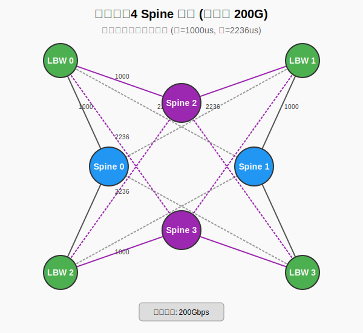

# 跨DC大模型训练仿真实验报告

## 1. 实验背景与配置

### 1.1 模型配置: LLaMA3.1 8B
参考链接: [config.json](https://huggingface.co/dphn/Dolphin3.0-Llama3.1-8B/raw/main/config.json)

```json
{
  "hidden_size": 4096,
  "intermediate_size": 14336,
  "model_type": "llama",
  "num_attention_heads": 32,
  "num_hidden_layers": 32,
  "num_key_value_heads": 8,
  "torch_dtype": "bfloat16",
  "vocab_size": 128258
}
```

### 1.2 训练超参数 (仿真一个训练Iteration)
- TP = 1
- DP = 4
- PP = 4
- Sequence Length = 8192
- GBS = 128 (微调)
- Token/Iteration = 1M
- Micro Batch Size = 2
- 优化器/加速：没有ZeRO，也没有FlashAttention优化

### 1.3 硬件参数与集合通信
- **NPU算力**: 312 TFLOPS (A100)
- **NPU显存带宽**: 1.56 TB/s (A100)
- **集合通信算法**: AllReduce - Ring (Chunk=4)

---

## 2. 网络拓扑架构

### 2.1 DC * 1 (单数据中心)

```mermaid
graph TD
    subgraph DC0 [Data Center 0]
        DC0_HBW[HBW Switch]
        NPU0_0[NPU 0]
        NPU0_1[NPU 1]
        NPU0_2[NPU 2]
        NPU0_3[NPU 3]
        DC0_LBW[LBW Switch]

        DC0_HBW ---|600GB/s, 10ns| NPU0_0
        DC0_HBW ---|600GB/s, 10ns| NPU0_1
        DC0_HBW ---|600GB/s, 10ns| NPU0_2
        DC0_HBW ---|600GB/s, 10ns| NPU0_3

        NPU0_0 ---|200Gb/s, 10us| DC0_LBW
        NPU0_1 ---|200Gb/s, 10us| DC0_LBW
        NPU0_2 ---|200Gb/s, 10us| DC0_LBW
        NPU0_3 ---|200Gb/s, 10us| DC0_LBW

        DC1_HBW[HBW Switch]
        NPU1_0[NPU 4]
        NPU1_1[NPU 5]
        NPU1_2[NPU 6]
        NPU1_3[NPU 7]
        DC1_LBW[LBW Switch]

        DC1_HBW ---|600GB/s, 10ns| NPU1_0
        DC1_HBW ---|600GB/s, 10ns| NPU1_1
        DC1_HBW ---|600GB/s, 10ns| NPU1_2
        DC1_HBW ---|600GB/s, 10ns| NPU1_3

        NPU1_0 ---|200Gb/s, 10us| DC1_LBW
        NPU1_1 ---|200Gb/s, 10us| DC1_LBW
        NPU1_2 ---|200Gb/s, 10us| DC1_LBW
        NPU1_3 ---|200Gb/s, 10us| DC1_LBW

        DC2_HBW[HBW Switch]
        NPU2_0[NPU 8]
        NPU2_1[NPU 9]
        NPU2_2[NPU 10]
        NPU2_3[NPU 11]
        DC2_LBW[LBW Switch]

        DC2_HBW ---|600GB/s, 10ns| NPU2_0
        DC2_HBW ---|600GB/s, 10ns| NPU2_1
        DC2_HBW ---|600GB/s, 10ns| NPU2_2
        DC2_HBW ---|600GB/s, 10ns| NPU2_3

        NPU2_0 ---|200Gb/s, 10us| DC2_LBW
        NPU2_1 ---|200Gb/s, 10us| DC2_LBW
        NPU2_2 ---|200Gb/s, 10us| DC2_LBW
        NPU2_3 ---|200Gb/s, 10us| DC2_LBW

        DC3_HBW[HBW Switch]
        NPU3_0[NPU 12]
        NPU3_1[NPU 13]
        NPU3_2[NPU 14]
        NPU3_3[NPU 15]
        DC3_LBW[LBW Switch]

        DC3_HBW ---|600GB/s, 10ns| NPU3_0
        DC3_HBW ---|600GB/s, 10ns| NPU3_1
        DC3_HBW ---|600GB/s, 10ns| NPU3_2
        DC3_HBW ---|600GB/s, 10ns| NPU3_3

        NPU3_0 ---|200Gb/s, 10us| DC3_LBW
        NPU3_1 ---|200Gb/s, 10us| DC3_LBW
        NPU3_2 ---|200Gb/s, 10us| DC3_LBW
        NPU3_3 ---|200Gb/s, 10us| DC3_LBW
    end

    Spine[Spine Switch]

    DC0_LBW ---|800Gb/s, 10us| Spine
    DC1_LBW ---|800Gb/s, 10us| Spine
    DC2_LBW ---|800Gb/s, 10us| Spine
    DC3_LBW ---|800Gb/s, 10us| Spine
```

<!-- <details>
<summary>点击查看拓扑图</summary> -->


<!-- </details> -->

### 2.2 DC * 4 (跨数据中心)

```mermaid
graph TD
    subgraph DCs [Data Centers - Square Layout]
        subgraph TopRow [Top Row]
            subgraph DC0 [Data Center 0]
                DC0_HBW[HBW Switch]
                NPU0_0[NPU 0]
                NPU0_1[NPU 1]
                NPU0_2[NPU 2]
                NPU0_3[NPU 3]
                DC0_LBW[LBW Switch]
                DC0_HBW ---|600GB/s, 10ns| NPU0_0
                DC0_HBW ---|600GB/s, 10ns| NPU0_1
                DC0_HBW ---|600GB/s, 10ns| NPU0_2
                DC0_HBW ---|600GB/s, 10ns| NPU0_3
                NPU0_0 ---|200Gb/s, 10us| DC0_LBW
                NPU0_1 ---|200Gb/s, 10us| DC0_LBW
                NPU0_2 ---|200Gb/s, 10us| DC0_LBW
                NPU0_3 ---|200Gb/s, 10us| DC0_LBW
            end
            subgraph DC1 [Data Center 1]
                DC1_HBW[HBW Switch]
                NPU1_0[NPU 4]
                NPU1_1[NPU 5]
                NPU1_2[NPU 6]
                NPU1_3[NPU 7]
                DC1_LBW[LBW Switch]
                DC1_HBW ---|600GB/s, 10ns| NPU1_0
                DC1_HBW ---|600GB/s, 10ns| NPU1_1
                DC1_HBW ---|600GB/s, 10ns| NPU1_2
                DC1_HBW ---|600GB/s, 10ns| NPU1_3
                NPU1_0 ---|200Gb/s, 10us| DC1_LBW
                NPU1_1 ---|200Gb/s, 10us| DC1_LBW
                NPU1_2 ---|200Gb/s, 10us| DC1_LBW
                NPU1_3 ---|200Gb/s, 10us| DC1_LBW
            end
        end
        subgraph BottomRow [Bottom Row]
            subgraph DC2 [Data Center 2]
                DC2_HBW[HBW Switch]
                NPU2_0[NPU 8]
                NPU2_1[NPU 9]
                NPU2_2[NPU 10]
                NPU2_3[NPU 11]
                DC2_LBW[LBW Switch]
                DC2_HBW ---|600GB/s, 10ns| NPU2_0
                DC2_HBW ---|600GB/s, 10ns| NPU2_1
                DC2_HBW ---|600GB/s, 10ns| NPU2_2
                DC2_HBW ---|600GB/s, 10ns| NPU2_3
                NPU2_0 ---|200Gb/s, 10us| DC2_LBW
                NPU2_1 ---|200Gb/s, 10us| DC2_LBW
                NPU2_2 ---|200Gb/s, 10us| DC2_LBW
                NPU2_3 ---|200Gb/s, 10us| DC2_LBW
            end
            subgraph DC3 [Data Center 3]
                DC3_HBW[HBW Switch]
                NPU3_0[NPU 12]
                NPU3_1[NPU 13]
                NPU3_2[NPU 14]
                NPU3_3[NPU 15]
                DC3_LBW[LBW Switch]
                DC3_HBW ---|600GB/s, 10ns| NPU3_0
                DC3_HBW ---|600GB/s, 10ns| NPU3_1
                DC3_HBW ---|600GB/s, 10ns| NPU3_2
                DC3_HBW ---|600GB/s, 10ns| NPU3_3
                NPU3_0 ---|200Gb/s, 10us| DC3_LBW
                NPU3_1 ---|200Gb/s, 10us| DC3_LBW
                NPU3_2 ---|200Gb/s, 10us| DC3_LBW
                NPU3_3 ---|200Gb/s, 10us| DC3_LBW
            end
        end
    end

    Spine[Spine Switch]

    DC0_LBW ---|800Gb/s, 1414us| Spine
    DC1_LBW ---|800Gb/s, 1414us| Spine
    DC2_LBW ---|800Gb/s, 1414us| Spine
    DC3_LBW ---|800Gb/s, 1414us| Spine
```

<!-- <details>
<summary>点击查看拓扑图</summary> -->


<!-- </details> -->

### 2.3 跨DC多Switch (Spine Switch)
- **2个交换机**


- **4个交换机**


---

## 3. 实验结果与性能分析

本节详细对比了不同的并行策略（数据并行 DP 和流水线并行 PP）在不同网络拓扑下的性能。

### 3.1 性能数据汇总表

| 实验场景 | 并行策略映射 | Wall Time (Cycles) | 暴露通信时间 (Cycles) | Wall Time相对值 | 暴露通信时间占比 |
| :--- | :--- | :--- | :--- | :--- | :--- |
| **DC内部 (Intra-DC)** | Intra-Node DP + Inter-Node PP | 6,119,227,668 | 242,684,816 | 1.000x | 3.97% |
| | Intra-Node PP + Inter-Node DP | 40,232,773,776 | 34,356,230,924 | 6.575x | 85.39% |
| **跨DC (Inter-DC)** | Intra-Node DP + Inter-DC PP | 6,152,923,668 | 276,380,816 | 1.006x | 4.49% |
| | Intra-Node PP + Inter-DC DP | 77,595,045,399 | 71,717,126,035 | 12.681x | 92.42% |

**结果分析：**
1. **PP vs DP 对带宽的敏感度**：无论是在单个 DC 内还是跨 DC 场景，将**模型并行 (PP) 放置在节点间/跨DC链路**上，而将**数据并行 (DP) 放置在节点内部**的性能表现远好于相反的策略。这是因为 DP (AllReduce) 会产生突发的巨大流量，更适合高带宽、低延迟的节点内网络；而 PP (P2P通信) 通信量相对较小且易于与计算重叠，适合跨节点/跨DC链路。
2. **跨DC延迟影响**：对比 Intra-DC PP 和 Inter-DC PP，跨 DC 增加的延迟对整体性能 (Wall Time) 影响极小（增加不到1%）。但如果是 Inter-DC DP，则性能下降极其严重（相比 Intra-DC DP 翻倍增加）。

### 3.2 跨DC多 Spine 交换机 (ECMP) 对比
在 **Intra-Node DP + Inter-DC PP** 的最优策略下，改变跨 DC 的 Spine Switch 数量以测试多路径网络对性能的影响：

| Spine Switch 数量 | Wall Time (Cycles) | 暴露通信时间 (Cycles) | Wall Time相对值 | 暴露通信时间占比 |
| :--- | :--- | :--- | :--- | :--- | 
| **1 个** | 6,152,923,668 | 276,380,816 | 1.000x | 4.49% | 
| **2 个** | 6,159,771,808 | 283,228,956 | 1.001x | 4.60% |
| **4 个** | 6,189,080,375 | 312,537,523 | 1.006x | 5.05% |

**结果分析：**
跨DC执行PP，在带宽合理分配的情况下，增加Spine交换机对性能影响不明显。

---


## 仿真后验流量矩阵
- 只验证了仿真环境一个环形AllGather算法的流量矩阵，可视化后的流量矩阵


## TODO
- [ ] 仿真LocalSGD进行跨DC训练的DP策略，减少DP产生的通信负载，测试性能
- [ ] TE?

- 仿真验证 （理论/论文复现）
- 光、电交换机比较，buffer对于交换机的影响
- 光、电交换机的区别在仿真器中怎么体现