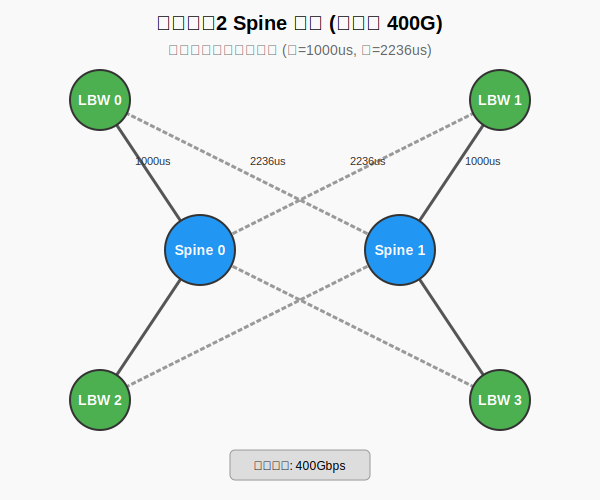
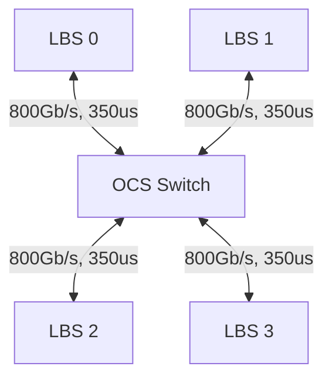
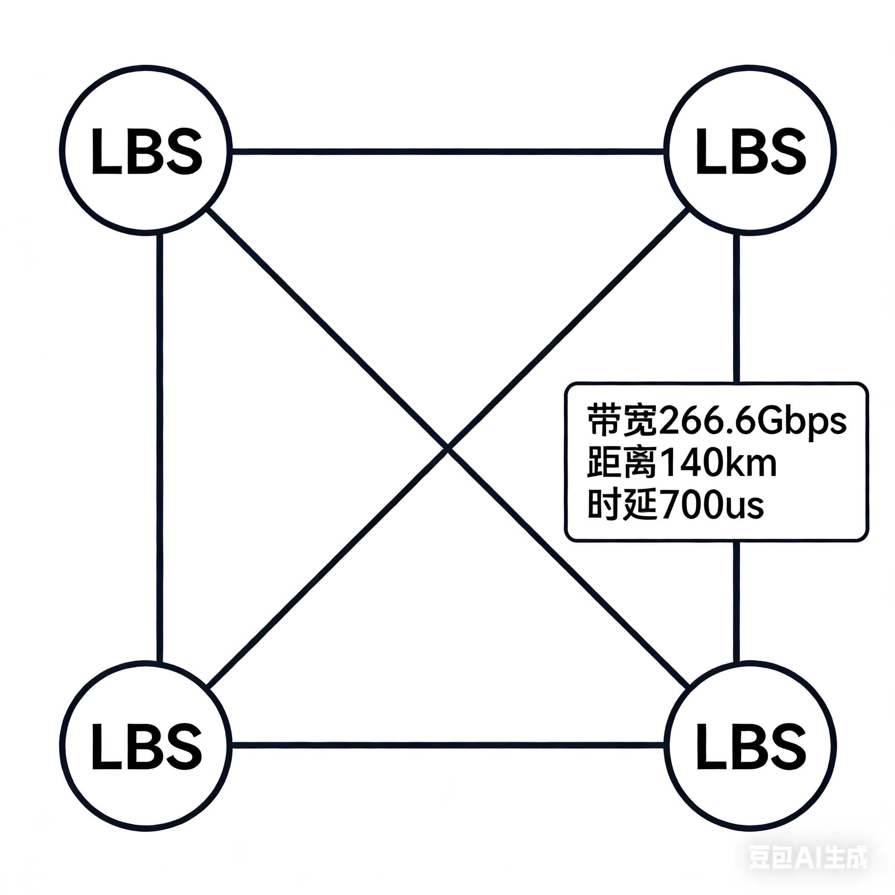
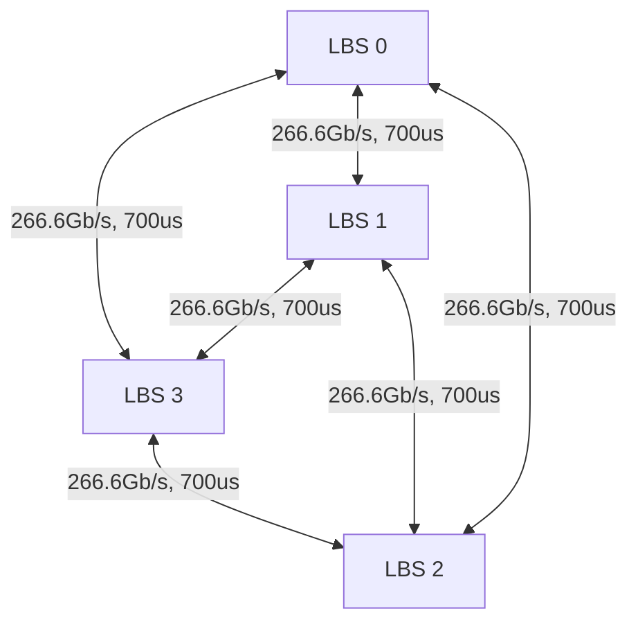
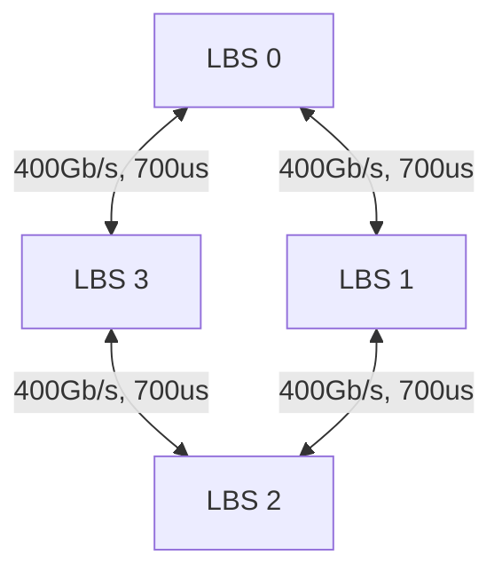

# 跨DC大模型训练仿真实验报告

## 1. 实验背景与配置

### 1.1 模型配置: LLaMA3.1 8B
参考链接: [config.json](https://huggingface.co/dphn/Dolphin3.0-Llama3.1-8B/raw/main/config.json)

```json
{
  "hidden_size": 4096,
  "intermediate_size": 14336,
  "model_type": "llama",
  "num_attention_heads": 32,
  "num_hidden_layers": 32,
  "num_key_value_heads": 8,
  "torch_dtype": "bfloat16",
  "vocab_size": 128258
}
```

### 1.2 训练超参数 (仿真一个训练Iteration)
- TP = 1
- DP = 4
- PP = 4
- Sequence Length = 8192
- GBS = 128 (微调)
- Token/Iteration = 1M
- Micro Batch Size = 2
- 优化器/加速：没有ZeRO，也没有FlashAttention优化

### 1.3 硬件参数与集合通信
- **NPU算力**: 312 TFLOPS (A100)
- **NPU显存带宽**: 1.56 TB/s (A100)
- **集合通信算法**: AllReduce - Ring (Chunk=4)

---

## 2. 网络拓扑架构

### 2.1 DC * 1 (单数据中心)

```mermaid
graph TD
    subgraph DC0 [Data Center 0]
        DC0_HBW[HBW Switch]
        NPU0_0[NPU 0]
        NPU0_1[NPU 1]
        NPU0_2[NPU 2]
        NPU0_3[NPU 3]
        DC0_LBW[LBW Switch]

        DC0_HBW ---|600GB/s, 150ns| NPU0_0
        DC0_HBW ---|600GB/s, 150ns| NPU0_1
        DC0_HBW ---|600GB/s, 150ns| NPU0_2
        DC0_HBW ---|600GB/s, 150ns| NPU0_3

        NPU0_0 ---|200Gb/s, 500ns| DC0_LBW
        NPU0_1 ---|200Gb/s, 500ns| DC0_LBW
        NPU0_2 ---|200Gb/s, 500ns| DC0_LBW
        NPU0_3 ---|200Gb/s, 500ns| DC0_LBW

        DC1_HBW[HBW Switch]
        NPU1_0[NPU 4]
        NPU1_1[NPU 5]
        NPU1_2[NPU 6]
        NPU1_3[NPU 7]
        DC1_LBW[LBW Switch]

        DC1_HBW ---|600GB/s, 150ns| NPU1_0
        DC1_HBW ---|600GB/s, 150ns| NPU1_1
        DC1_HBW ---|600GB/s, 150ns| NPU1_2
        DC1_HBW ---|600GB/s, 150ns| NPU1_3

        NPU1_0 ---|200Gb/s, 500ns| DC1_LBW
        NPU1_1 ---|200Gb/s, 500ns| DC1_LBW
        NPU1_2 ---|200Gb/s, 500ns| DC1_LBW
        NPU1_3 ---|200Gb/s, 500ns| DC1_LBW

        DC2_HBW[HBW Switch]
        NPU2_0[NPU 8]
        NPU2_1[NPU 9]
        NPU2_2[NPU 10]
        NPU2_3[NPU 11]
        DC2_LBW[LBW Switch]

        DC2_HBW ---|600GB/s, 150ns| NPU2_0
        DC2_HBW ---|600GB/s, 150ns| NPU2_1
        DC2_HBW ---|600GB/s, 150ns| NPU2_2
        DC2_HBW ---|600GB/s, 150ns| NPU2_3

        NPU2_0 ---|200Gb/s, 500ns| DC2_LBW
        NPU2_1 ---|200Gb/s, 500ns| DC2_LBW
        NPU2_2 ---|200Gb/s, 500ns| DC2_LBW
        NPU2_3 ---|200Gb/s, 500ns| DC2_LBW

        DC3_HBW[HBW Switch]
        NPU3_0[NPU 12]
        NPU3_1[NPU 13]
        NPU3_2[NPU 14]
        NPU3_3[NPU 15]
        DC3_LBW[LBW Switch]

        DC3_HBW ---|600GB/s, 150ns| NPU3_0
        DC3_HBW ---|600GB/s, 150ns| NPU3_1
        DC3_HBW ---|600GB/s, 150ns| NPU3_2
        DC3_HBW ---|600GB/s, 150ns| NPU3_3

        NPU3_0 ---|200Gb/s, 500ns| DC3_LBW
        NPU3_1 ---|200Gb/s, 500ns| DC3_LBW
        NPU3_2 ---|200Gb/s, 500ns| DC3_LBW
        NPU3_3 ---|200Gb/s, 500ns| DC3_LBW
    end

    Spine[Spine Switch]

    DC0_LBW ---|800Gbs/s, 600ns| Spine
    DC1_LBW ---|800Gbs/s, 600ns| Spine
    DC2_LBW ---|800Gbs/s, 600ns| Spine
    DC3_LBW ---|800Gbs/s, 600ns| Spine
```

<!-- <details>
<summary>点击查看拓扑图</summary> -->



### 2.2 DC * 4 (跨数据中心)

```mermaid
graph TD
    subgraph DCs [Data Centers - Square Layout]
        subgraph TopRow [Top Row]
            subgraph DC0 [Data Center 0]
                DC0_HBW[HBW Switch]
                NPU0_0[NPU 0]
                NPU0_1[NPU 1]
                NPU0_2[NPU 2]
                NPU0_3[NPU 3]
                DC0_LBW[LBW Switch]
                DC0_HBW ---|600GB/s, 150ns| NPU0_0
                DC0_HBW ---|600GB/s, 150ns| NPU0_1
                DC0_HBW ---|600GB/s, 150ns| NPU0_2
                DC0_HBW ---|600GB/s, 150ns| NPU0_3
                NPU0_0 ---|200Gb/s, 500ns| DC0_LBW
                NPU0_1 ---|200Gb/s, 500ns| DC0_LBW
                NPU0_2 ---|200Gb/s, 500ns| DC0_LBW
                NPU0_3 ---|200Gb/s, 500ns| DC0_LBW
            end
            subgraph DC1 [Data Center 1]
                DC1_HBW[HBW Switch]
                NPU1_0[NPU 4]
                NPU1_1[NPU 5]
                NPU1_2[NPU 6]
                NPU1_3[NPU 7]
                DC1_LBW[LBW Switch]
                DC1_HBW ---|600GB/s, 150ns| NPU1_0
                DC1_HBW ---|600GB/s, 150ns| NPU1_1
                DC1_HBW ---|600GB/s, 150ns| NPU1_2
                DC1_HBW ---|600GB/s, 150ns| NPU1_3
                NPU1_0 ---|200Gb/s, 500ns| DC1_LBW
                NPU1_1 ---|200Gb/s, 500ns| DC1_LBW
                NPU1_2 ---|200Gb/s, 500ns| DC1_LBW
                NPU1_3 ---|200Gb/s, 500ns| DC1_LBW
            end
        end
        subgraph BottomRow [Bottom Row]
            subgraph DC2 [Data Center 2]
                DC2_HBW[HBW Switch]
                NPU2_0[NPU 8]
                NPU2_1[NPU 9]
                NPU2_2[NPU 10]
                NPU2_3[NPU 11]
                DC2_LBW[LBW Switch]
                DC2_HBW ---|600GB/s, 150ns| NPU2_0
                DC2_HBW ---|600GB/s, 150ns| NPU2_1
                DC2_HBW ---|600GB/s, 150ns| NPU2_2
                DC2_HBW ---|600GB/s, 150ns| NPU2_3
                NPU2_0 ---|200Gb/s, 500ns| DC2_LBW
                NPU2_1 ---|200Gb/s, 500ns| DC2_LBW
                NPU2_2 ---|200Gb/s, 500ns| DC2_LBW
                NPU2_3 ---|200Gb/s, 500ns| DC2_LBW
            end
            subgraph DC3 [Data Center 3]
                DC3_HBW[HBW Switch]
                NPU3_0[NPU 12]
                NPU3_1[NPU 13]
                NPU3_2[NPU 14]
                NPU3_3[NPU 15]
                DC3_LBW[LBW Switch]
                DC3_HBW ---|600GB/s, 150ns| NPU3_0
                DC3_HBW ---|600GB/s, 150ns| NPU3_1
                DC3_HBW ---|600GB/s, 150ns| NPU3_2
                DC3_HBW ---|600GB/s, 150ns| NPU3_3
                NPU3_0 ---|200Gb/s, 500ns| DC3_LBW
                NPU3_1 ---|200Gb/s, 500ns| DC3_LBW
                NPU3_2 ---|200Gb/s, 500ns| DC3_LBW
                NPU3_3 ---|200Gb/s, 500ns| DC3_LBW
            end
        end
    end

    Spine[Spine Switch]

    DC0_LBW ---|800Gb/s, 350us| Spine
    DC1_LBW ---|800Gb/s, 350us| Spine
    DC2_LBW ---|800Gb/s, 350us| Spine
    DC3_LBW ---|800Gb/s, 350us| Spine
```



### 2.3 跨DC多个电Switch (Spine Switch)
- **2个交换机**



### 2.4 单个光交换机物理拓扑
- 4个LBS，位于正方形的四个角
- 一个OCS，位于正方形的中心
- 正方形边长100km，每个LBS和OCS距离大约70km(时延350us), 每个LBS都和OCS直连



#### 2.4.1 逻辑拓扑Full mesh
- 4个LBS物理上位于正方形的四个角，每个LBS都和其他三个LBS直接相连
- 每个LBS和其他三个LBS之间的链路带宽都是800/3Gbps； 距离都是140km, 时延都是700us




#### 2.4.2 逻辑拓扑Ring
- 4个LBS物理上还是位于正方形的四个角，每个LBS和两个LBS直接相连，4个LBS组成Ring（正方形的四条边）
- LBS0 <--> 1 <--> 2 <--> 3 <--> 0
- 链路带宽都是400Gbps; 时延都是700us




---

## 3. 实验结果与性能分析

本节详细对比了不同的并行策略（数据并行 DP 和流水线并行 PP）在不同网络拓扑下的性能。

### 3.1 性能数据汇总表

| 实验场景 | 并行策略映射 | Wall Time (Cycles) | 暴露通信时间 (Cycles) | Wall Time相对值 | 暴露通信时间占比 |
| :--- | :--- | :--- | :--- | :--- | :--- |
| **DC内部 (Intra-DC)** | Intra-Node DP + Inter-Node PP | 6,119,227,668 | 242,684,816 | 1.000x | 3.97% |
| | Intra-Node PP + Inter-Node DP | 40,232,773,776 | 34,356,230,924 | 6.575x | 85.39% |
| **跨DC (Inter-DC)** | Intra-Node DP + Inter-DC PP | 6,152,923,668 | 276,380,816 | 1.006x | 4.49% |
| | Intra-Node PP + Inter-DC DP | 77,595,045,399 | 71,717,126,035 | 12.681x | 92.42% |

**结果分析：**


