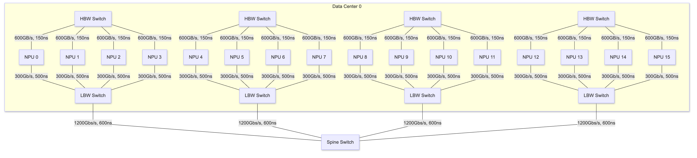
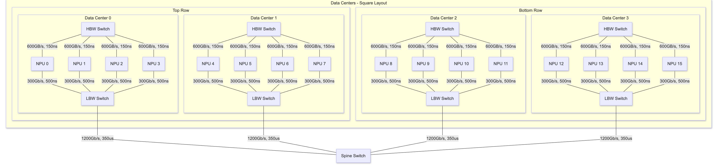
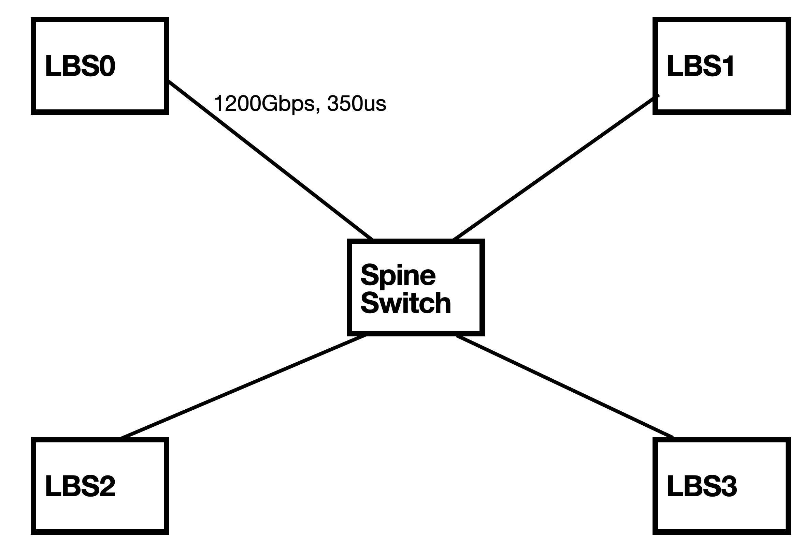
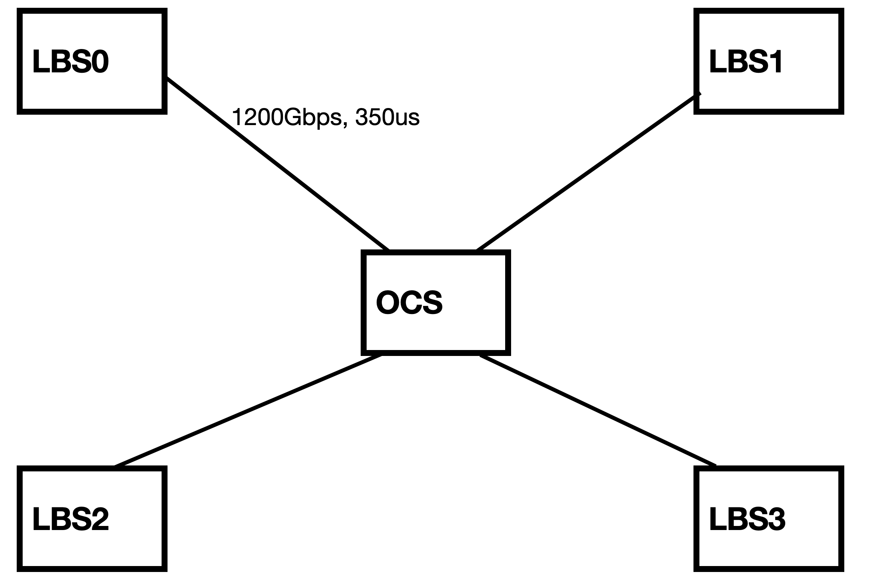
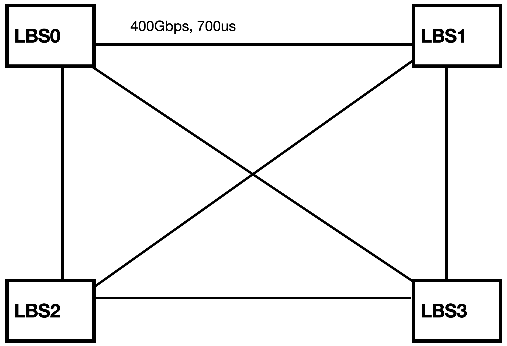
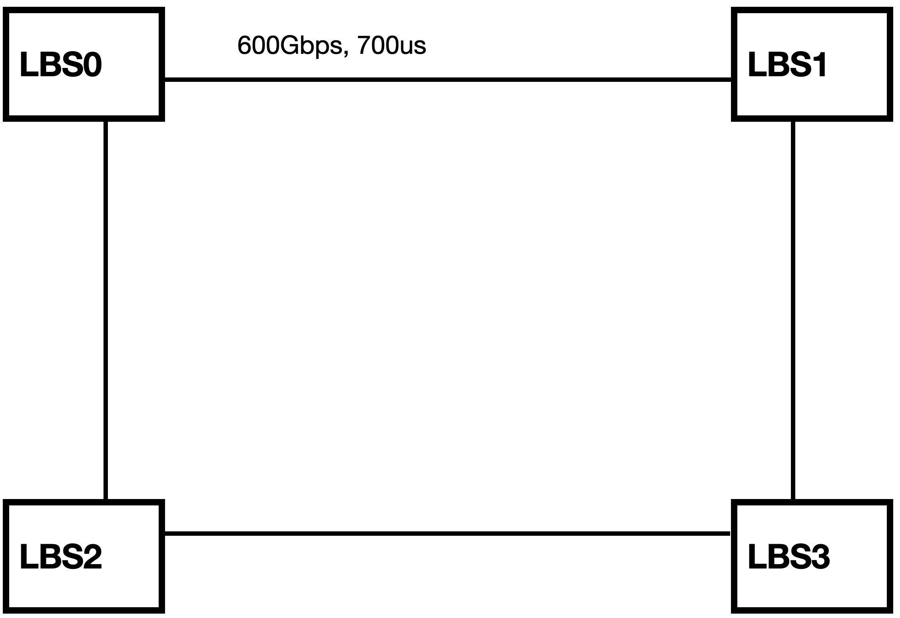
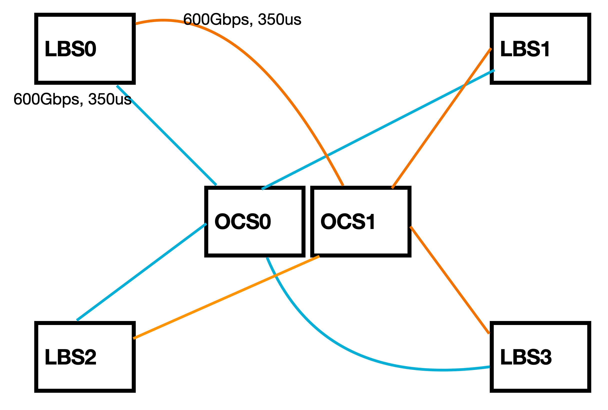
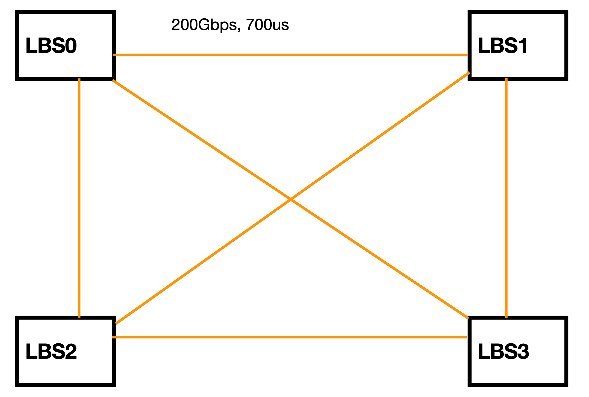
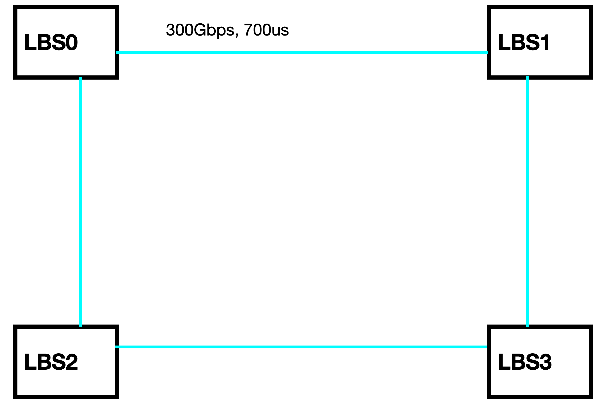
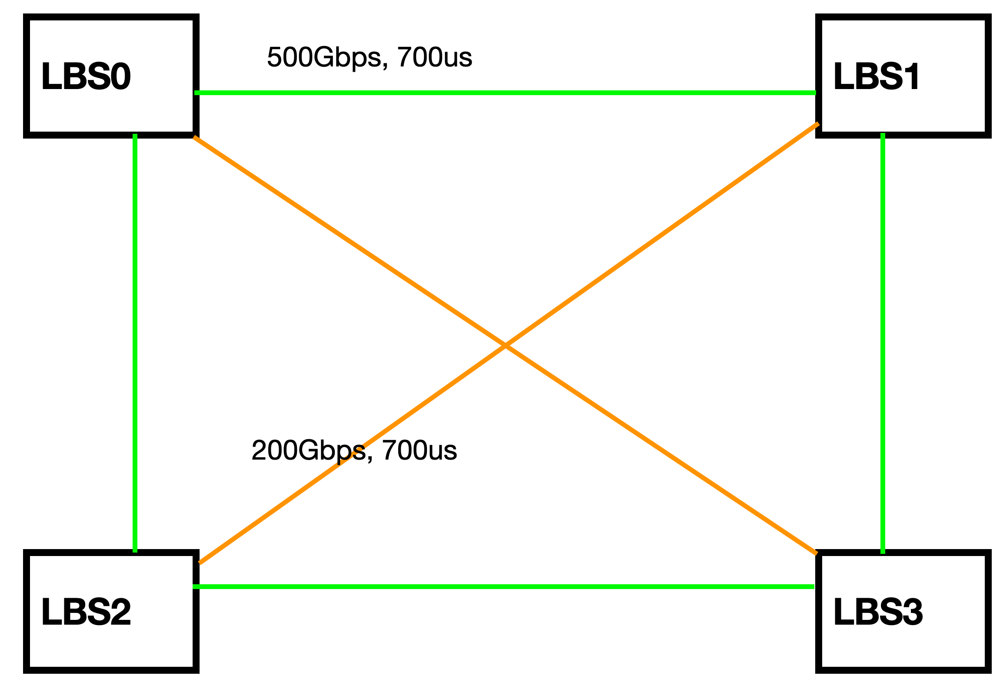

# 跨DC大模型训练仿真实验计划

## 0. 实验目的
本实验旨在通过Astra-Sim仿真平台，评估跨DC训练大模型（LLaMA3.1 8B）时不同并行策略（数据并行 DP 和流水线并行 PP）
在不同网络拓扑下的性能表现。通过对比跨DC各种拓扑进行训练的性能数据，分析通信开销和计算效率，
- 比较不同的并行策略进行跨DC模型训练的通信开销和计算效率，验证哪种策略适合跨DC训练；
- 验证跨DC进行模型训练的可行性；
- 评估使用光交换机OCS和电交换机Spine Switch在跨DC训练中的性能差异；
- 利用光交换机OCS的可重构性，比较不同的网络拓扑在跨DC训练的性能差异；
- 通过多个光交换机组成跨DC网络，在OCS节点故障的情况下进行模型训练，评估系统的鲁棒性和性能表现。


## 1. 实验背景与配置

### 1.1 模型配置: LLaMA3.1 8B
参考链接: [config.json](https://huggingface.co/dphn/Dolphin3.0-Llama3.1-8B/raw/main/config.json)

```json
{
  "hidden_size": 4096,
  "intermediate_size": 14336,
  "model_type": "llama",
  "num_attention_heads": 32,
  "num_hidden_layers": 32,
  "num_key_value_heads": 8,
  "torch_dtype": "bfloat16",
  "vocab_size": 128258
}
```

### 1.2 训练超参数 (仿真一个训练Iteration)
- TP = 1
- DP = 4
- PP = 4
- Sequence Length = 8192
- GBS = 128 (微调)
- Token/Iteration = 1M
- Micro Batch Size = 2
- 不使用ZeRO，FlashAttention等优化技术

### 1.3 硬件参数与集合通信
- **NPU算力**: 312 TFLOPS (A100)
- **NPU显存带宽**: 1.56 TB/s (A100)
- **集合通信算法**: AllReduce - Ring (Chunk=4)

---

## 2. 网络拓扑架构

### 2.1 DC * 1 (单数据中心)
- 每四个NPU和一个HBW Switch互联，模拟DGX A100 4GPU的Server Node，NPU带宽600GB/s
- Node之间的NPU通过LBW Switch组成Clos网络拓扑，带宽收敛比为1：1，NPU带宽300Gbps



### 2.2 DC * 4 (跨数据中心)
- 每四个NPU和一个HBW Switch互联，模拟DGX A100 4GPU的Server Node，NPU带宽600GB/s
- 跨Node的NPU通过LBW Switch组成Clos网络拓扑，带宽收敛比为1：1，NPU带宽300Gbps
- 四个Node分别位于单独的Data Center中，每个DC和Spine交换机的距离都是70km，时延350us






### 2.3 跨DC多个电Switch (Spine Switch)
- DC内部的网络配置和2.1, 2.2相同
- 跨DC通过2个Spine Switch完成互联，链路带宽都是600Gbps，时延如图所示


### 2.4 单个光交换机OCS
#### 2.4.1 物理拓扑
- DC内部的网络设置和2.1, 2.2, 2.3完全相同
- 4个LBW Switch，位于正方形的四个顶点
- 一个OCS，位于正方形的中心位置(位置和**2.2的Spine Switch**相同)
- 每个LBW Switch和OCS距离设置为70km(时延350us), 每个LBW Switch都和OCS直连



#### 2.4.2 逻辑拓扑Full mesh
- 每个LBW Switch都和其他三个LBW Switch直接相连，组成full mesh拓扑
- 每个LBW Switch和其他三个LBW Switch之间的链路带宽都是400Gbps； 链路距离都是140km, 时延都是700us



#### 2.4.3 逻辑拓扑Ring
- 4个LBW Switch物理上位于正方形的四个顶点，每个LBW Switch和两个LBW Switch直接相连(通过OCS完成)，4个LBW Switch组成Ring（正方形的四条边）
- LBW Switch 0 <--> 1 <--> 3 <--> 2 <--> 0
- 链路带宽都是600Gbps; 时延都是700us



### 2.5 分布式光交换机 (还不确定具体方案，TODO)

#### 2.5.1 物理拓扑



#### 2.5.2 逻辑拓扑






---

## 3. 实验结果与性能分析

本节对比不同的并行策略（数据并行 DP 和流水线并行 PP）在不同网络拓扑下的性能。

### 3.1 性能数据汇总表

| 实验场景 | 并行策略映射 | Wall Time (Cycles) | 暴露通信时间 (Cycles) | Wall Time相对值 | 暴露通信时间占比 |
| :--- | :--- | :--- | :--- | :--- | :--- |
| **(Intra-DC)** | Intra-Node DP + Inter-Node PP |  | |  | |
| | Intra-Node PP + Inter-Node DP |  |  |  | |
| **(Inter-DC) Spine Switch * 1** | Intra-DC DP + Inter-DC PP |  |  |  | |
| **(Inter-DC) Spine Switch * 2** | Intra-DC DP + Inter-DC PP |  |  |  | |
| **(Inter-DC) OCS-Fullmesh** | Intra-DC DP + Inter-DC PP |  |  |  |  |
| **(Inter-DC) OCS-Ring** | Intra-DC DP + Inter-DC PP |  |  |  |  |
| **(Inter-DC) OCS*2 Fullmesh + Ring** | Intra-DC DP + Inter-DC PP |  |  |  |  |

### 3.2 结果分析
----

## 4 实验计划
- [ ] ns-3 网络分流问题: 存在多路径流量可以按配置比例分配到不同的路径上
- [ ] 在Astra-Sim中实现DiLoCo/Local SGD
- [ ] 按照第二节的网络拓扑架构，分别进行训练仿真

